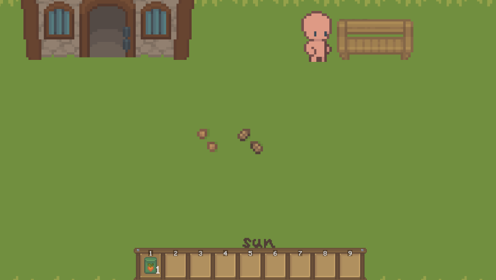
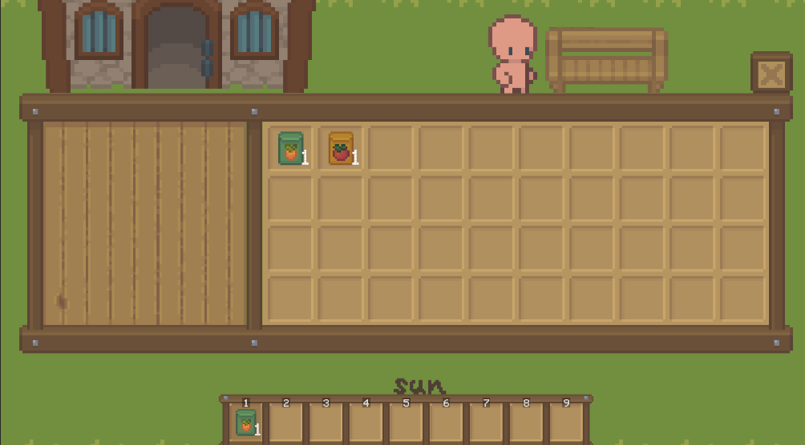

# FarmGame
Unity3D开发的2D开放式农场游戏。

例图：




运行：
```bash
git clone https://github.com/FuZoe/FarmGame2D.git
```
使用Unity Hub或者Tuanjie Hub打开项目文件夹(推荐使用最新版编辑器，或者1.4.2以上编辑器版本！）

## 当前可玩系统

项目启动后会自动创建运行时系统：农田、播种、浇水、作物三日生长、收获、体力、游戏时间、金币、商店、NPC 对话、任务奖励、烹饪、存档/读档、场景切换、音量和全屏设置。

主要操作：

- `1` 锄地，`2` 浇水，`3` 选种子，`4` 收获；`E` 使用当前工具，`Z`/`X` 播种胡萝卜/番茄。
- `N` 与附近 NPC 对话，`B` 买种子，`V` 卖种子，`K` 烹饪，`Q` 接取/领取任务，`Space` 睡觉。
- `F5` 存档，`F9` 读档，`F1`-`F4` 切换四个场景，`F10` 切换全屏，`PageUp`/`PageDown` 调整音量。
